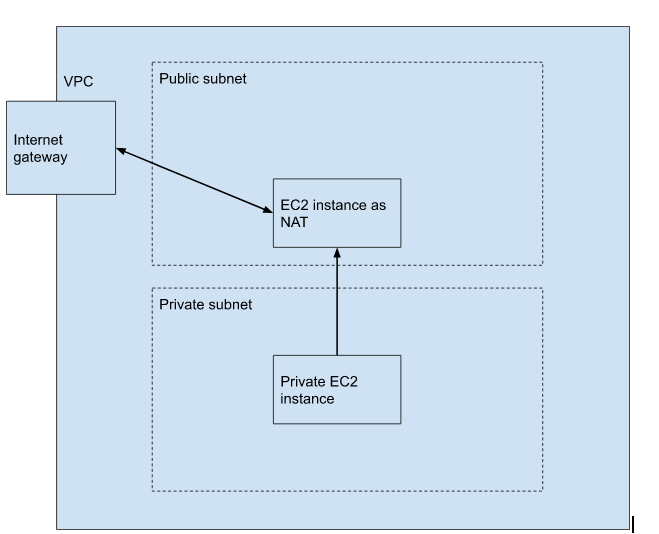

This example use a EC2 instance as NAT

The diagram of network:

The EC2 instance in public subnet can connect to internet by default.

The EC2 instance in private subnet has a one way connection to internet with a 
routing via the NAT instance. The client in the internet can't connect to 
this private EC2.